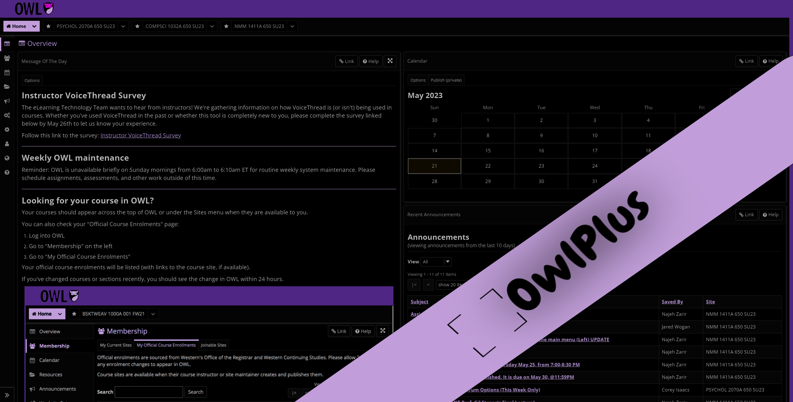

# OwlPlus
Elevate Your Owl Experience!

## The Power of OwlPlus
OwlPlus is a Chrome extension that enhances your browsing experience on Western University's learning management system, Owl. With OwlPlus, you can unlock a range of powerful features that improve usability, accessibility, and customization options. Take control of your online learning with these key features:

### Dark Mode
Immerse yourself in a sleek and eye-friendly browsing experience with our elegant dark theme. Activate Dark Mode to reduce eye strain and enjoy a visually appealing interface.

### Optimized Layout
Navigate your school website effortlessly with a streamlined interface, ensuring swift and seamless browsing. OwlPlus enhances the layout of Owl, making it more intuitive and user-friendly.

### Enhanced Accessibility
Prioritize readability and reduce eye strain through enhanced accessibility features, making your browsing experience comfortable and inclusive. OwlPlus ensures that all users can access and engage with course materials effectively.

### Customization Options
Tailor your browsing experience to your preferences with a range of customizable settings, putting you in control. Personalize Owl with options to adjust font sizes, color schemes, and more, allowing you to optimize your learning environment.

### Faster Performance
Experience lightning-fast performance and accelerated browsing speeds, enabling you to access your school's resources with unmatched efficiency. OwlPlus ensures that you can quickly navigate through courses, assignments, and discussions without any delays.

## Troubleshooting
If you encounter any difficulties, please check the permissions in the extension settings. Ensure that OwlPlus has the necessary permissions to access and enhance the Owl learning management system.

## How to Use
1. Install the OwlPlus Chrome extension from the Chrome Web Store.
2. Once installed, locate the OwlPlus toggle switch in your browser toolbar.
3. Click the toggle switch to enable or disable OwlPlus functionality.
4. Explore the various features and enjoy an elevated browsing experience on Owl.

